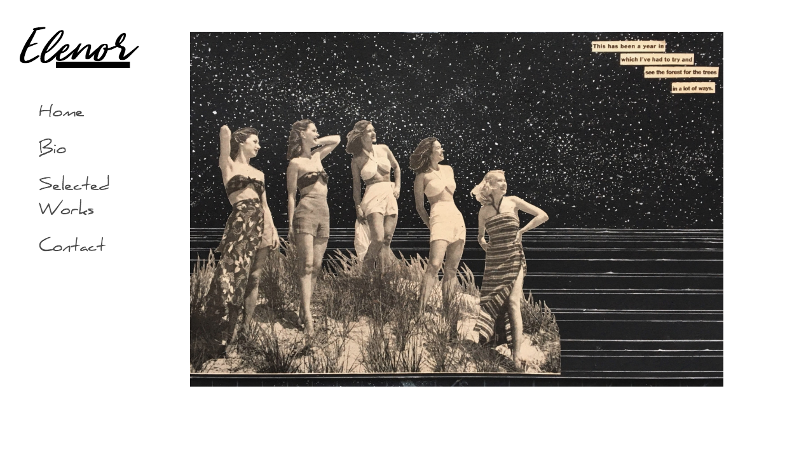
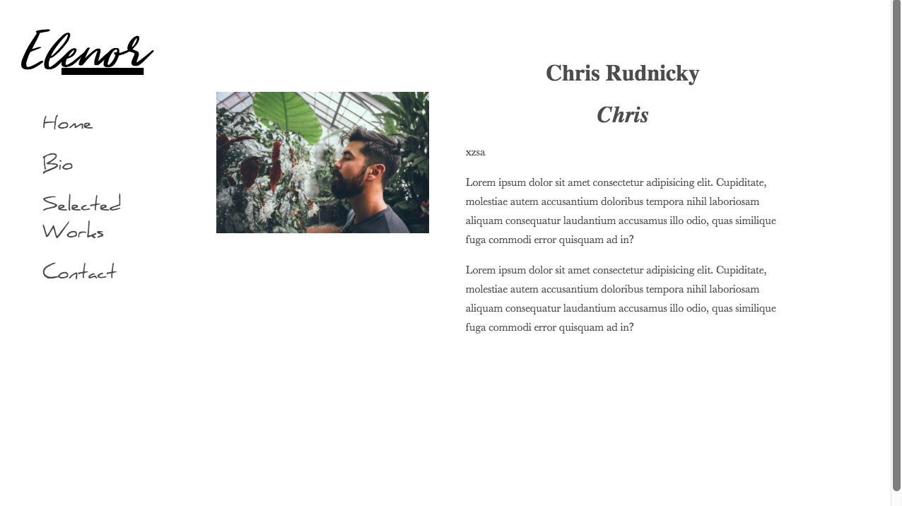
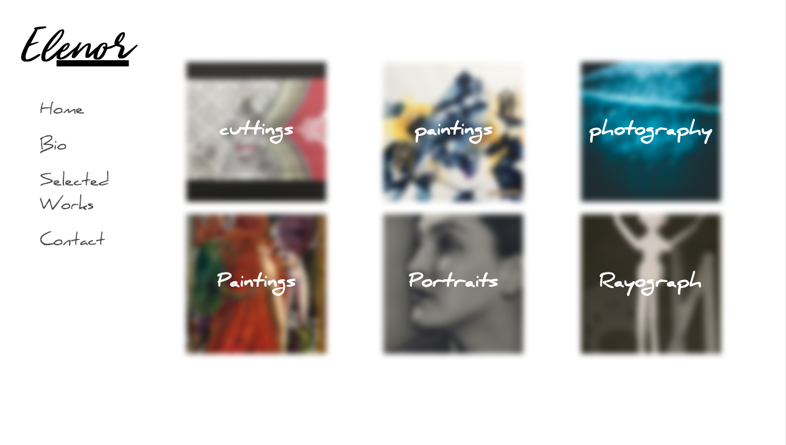
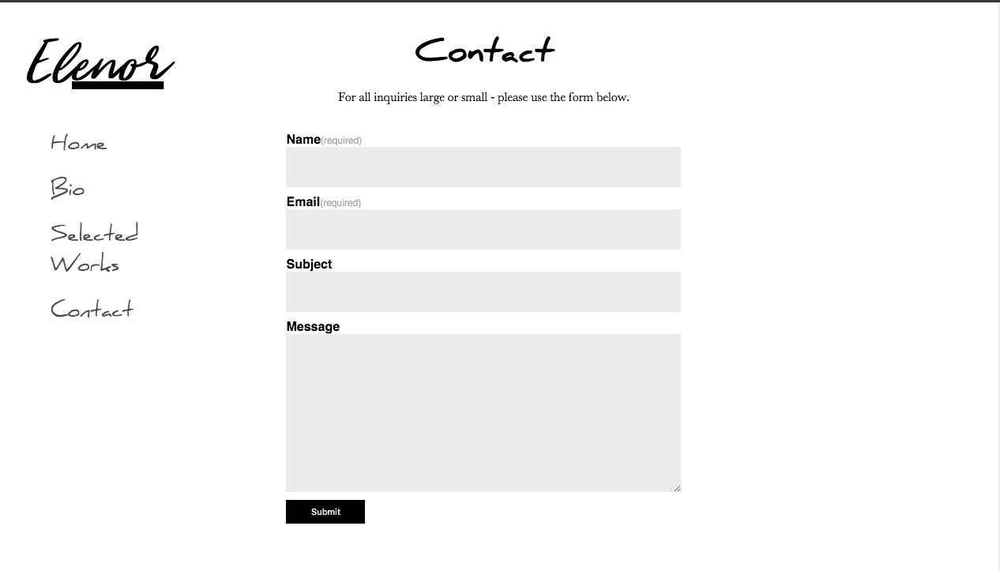

# Elenor
Designed By: Chris Rudnicky  

## Table of Contents
[Description](#description)  
[Installation and Usage](#installation-instructions)
[Views](views)
[Planning](#planning)   
[Technologies Used](#technologies-used)

---

## Description

Elenor is my capstone project at Epicodus. Elenor will act as both a portfolio website as well as a tool for sourcing images. Anybody can use Elenor who wants to showcase their work, however it is being designed for a local artist, Shaina Morales.

It can be difficult for collage artists to source vintage images outside of physcial magazines. Elenor will address this problem by connecting to different API's that host vintage ads and pictures. From there, anyone who uses Elenor will be able to begin to create collections of images that will be persisted on Firebase.

---

## Installation Instructions

 Eleno-r is still in development so there is only a development environment set up currently.

The easiest way to download Eleno-r is by running the following commands in the terminal:

    1. $ cd desktop
    2. $ git clone https://github.com/68thandMaine/Eleno-r.git
    3. Obtain a Firebase key with the steps below.
    4. $ cd Eleno-r && npm install
    5. $ npm run start

### Obtaining a Firebase Key
In order to view Eleno-r, a user will need to obtain a Firebase key.  

1. Create an account with / log into an exisiting account on [Firebase]('https://firebase.google.com').  
2. Click go to console in the upper right. 
3. Click Add Project
    - use all defaults
4. Collect the Firebase configuration information by clicking the </> icon  
5. Copy all of the information from the config object
6. Under src/constants create a file called firebaseConfig.js
7. Paste the config object into the file and rename it to **const firebaseConfig**
8. Export the configuration by adding **export default firebaseConfig;** to the bottom of the file. 

src > constants > firebaseConfig.js

Place the key infromation from Firebase in here.

---

## Views

Currently the application has the following views
### Landing Page:

### Bio

### Gallery 

### Contact 

---

## Planning

I intend for this site to have a React front end that will collect information from forms and send to a C#/MySql backend. The backend should be able to handle API calls and store information in both SQL and Firebase databases.

To view more detailed information about Elenor visit the following files: 
[External Resources](./src/assets/supportdocs/ExternalResources.md) 
[Feature Table](./src/assets/supportdocs/FeatureTable.md)  
[Planning Table](./src/assets/supportdocs/PlanningTable.md) 

- Phase 1 / React Front End
    - Components:
        - Admin [x]
         - Upload [x]
                - New Art Information [x]
                - Profile infomation [x]
            - API Call
                - Picture Return / Save picture
        - Splash Page / artist welcome [x]
            - About [x]
            - Contact [x]
            - Gallery [x ]
                - View by category [x]
                - View indivdiual image [x]

- Phase 2:
    - Refactor Firebase backend to a manually created database.
        - Express
        - MySql

- Phase 3:
    - Add animations and further styling to API search feature

---

## Technologies Used

React   
Redux  
Firebase  
Library of Congress API  
Radium  

---

## License

MIT
